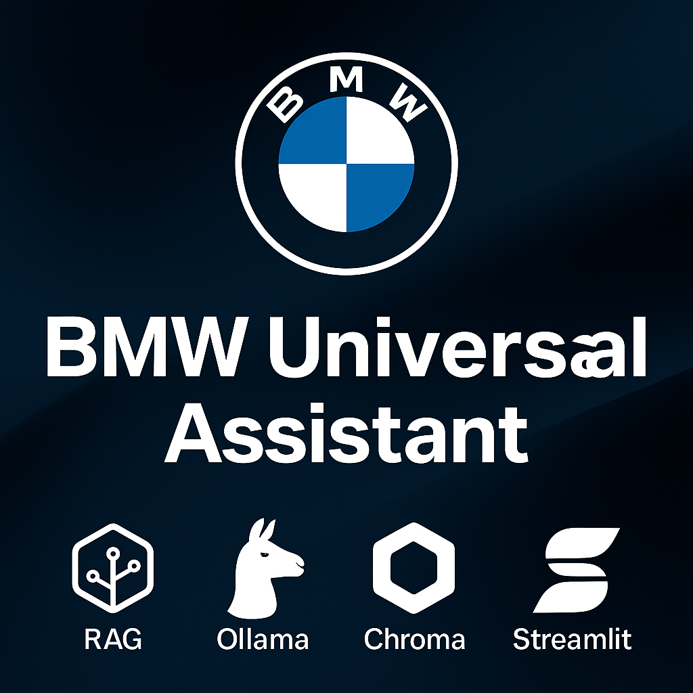

  

🚗 BMW Universal Assistant

A local, privacy-preserving AI assistant built for BMW vehicles.
Uses RAG retrieval + Chroma DB + Ollama + Streamlit, able to process fault codes and look up information from manuals — all fully offline.

Ideal for quick reference, diagnostic lookup, and manual-based information queries without cloud dependency.

🔍 What It Can Do

Retrieve OBD-II fault code descriptions (CSV-based)

Read & extract information from BMW owner manuals (PDF)

Smart routing:

Error Code → CSV lookup

Model/Feature Query → Manuals RAG

Mixed Input → Combines both

Runs entirely on-device (no API, no internet required)

Modern Streamlit UI for fast Q&A

🛠 Installation
git clone https://github.com/mahmutcanborann/BMW-AI-Assistant.git
cd BMW-AI-Assistant
pip install -r requirements.txt

Install LLM model via Ollama:

ollama pull llama3.2:3b

📦 Preparing the Database

Place BMW manuals inside:

/data/manuals/

Generate embeddings:

python main.py

This will create:

/chroma_db/

Chroma DB is not included in the repo — it is rebuilt locally for performance reasons.

▶ Run the Application
streamlit run app.py

Example queries:

What does P0300 mean?
How to pair an iPhone in BMW 3 Series?
P0171 in BMW F30 — possible causes?

🤝 Contributing

Contributions and suggestions are welcome.
If this project is useful to you:

⭐ Please star the repository.
