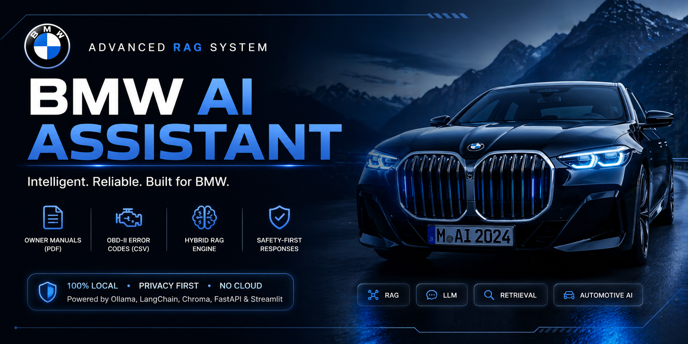
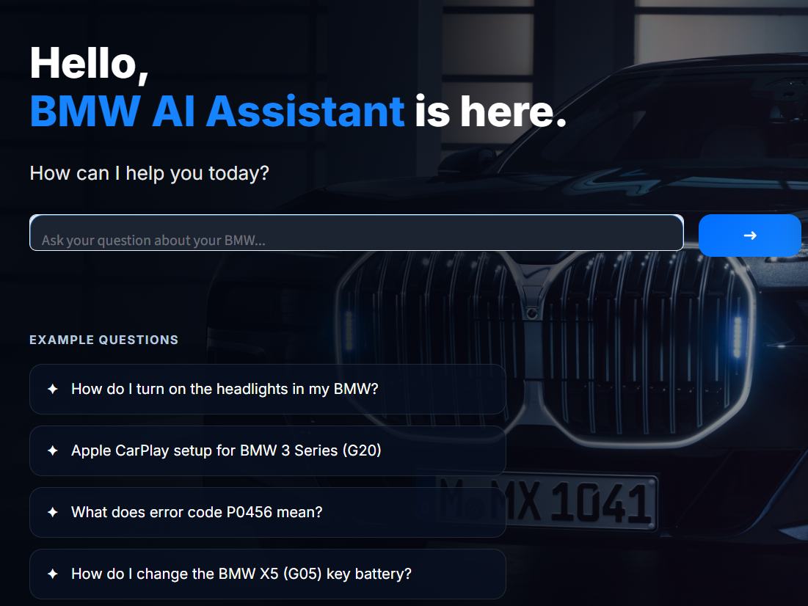
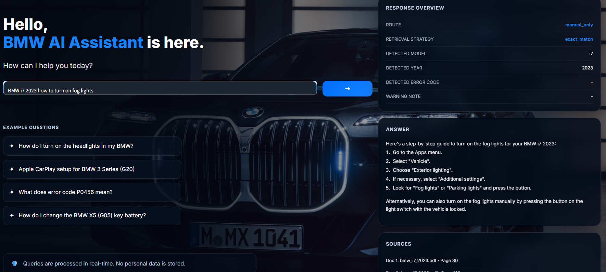
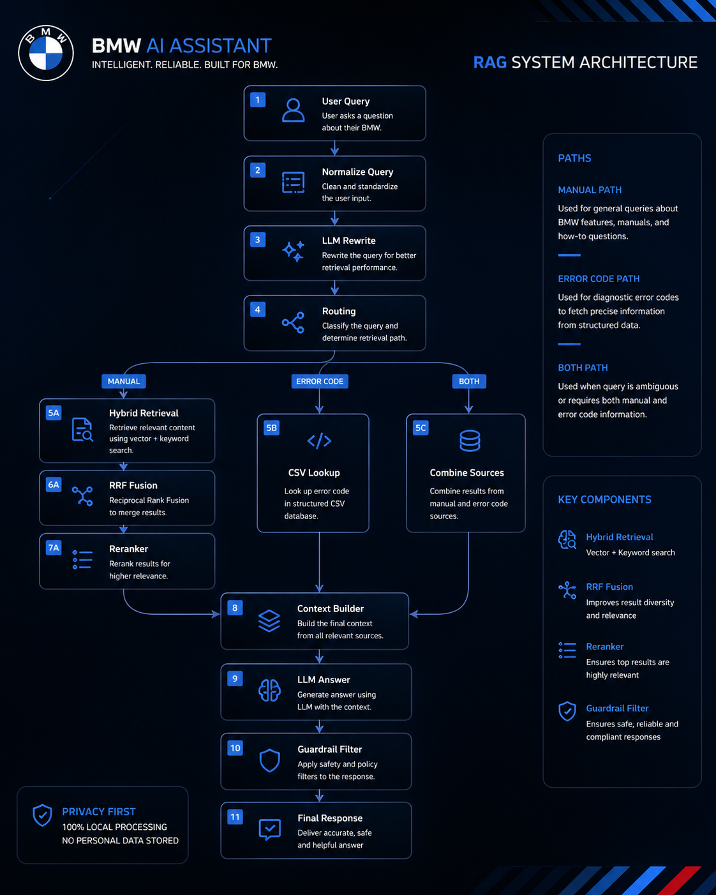

# 🚗 BMW AI Assistant — Advanced RAG System

<p align="center">
  
</p>

<p align="center">
  
  
  
  
</p>

## 🧠 Overview

BMW AI Assistant is a privacy-first, fully local RAG system designed for BMW vehicles.

It combines:

- Owner manuals (PDF)
- OBD-II error codes (CSV)
- Natural language queries

into a single intelligent assistant that prioritizes accuracy, safety, and reliability over guesswork.

> ⚠️ The system avoids hallucinations and returns safe fallback responses when information is uncertain.

## 🖥️ UI Preview

### 🏠 Home Screen

<p align="center">
  
</p>

### 🤖 Response View

<p align="center">
  
</p>

## ⚡ What Makes This Different

This is not a basic RAG demo.

It is a multi-stage retrieval system with safety-aware design.

### 🔍 Retrieval Layer

- Hybrid retrieval (BM25 + Vector Search)
- Reciprocal Rank Fusion (RRF)
- Cross-encoder reranking

### 🧩 Query Intelligence

- Query normalization
- LLM-based query rewriting
- Feature-aware query expansion

### 🚗 BMW-Aware Logic

- Model detection
- Year extraction
- Generation mapping
- Error code recognition

### 🛡 Safety Layer

- Guardrails to reduce hallucinations
- Context-grounded answers only
- Controlled fallback responses

## 🏗 System Architecture

This diagram shows the full RAG pipeline from user query to final response.

<p align="center">
  
</p>

## 🛠 Tech Stack

- FastAPI — backend API
- Streamlit — frontend UI
- LangChain — pipeline orchestration
- Chroma — embedding storage
- Ollama — local LLM inference

### Models

- Embedding: `all-MiniLM-L6-v2`
- Reranker: `ms-marco-MiniLM-L-6-v2`
- LLM: `llama3.2:3b`

## 📁 Project Structure

````bash
project/
│
├── main.py              # FastAPI backend
├── app.py               # Streamlit frontend
├── data/                # Manuals + error codes
├── chroma_db/           # Vector DB
├── splits_cache.pkl     # Cache
├── assets/              # Images
└── README.md
## ⚙️ Installation

```bash
git clone https://github.com/mahmutcanborann/BMW-AI-Assistant.git
cd BMW-AI-Assistant

python -m venv .venv
.venv\Scripts\activate   # Windows
# source .venv/bin/activate  # Mac/Linux

pip install -r requirements.txt
## 🤖 Setup Local LLM

```bash
ollama pull llama3.2:3b

## 📦 Build Database / Run Backend

```bash
uvicorn main:app --reload
````

**First run will automatically:**

- Load PDFs
- Split documents
- Create embeddings
- Build Chroma DB

---

## 🚀 Run UI

```bash
streamlit run app.py
```

---

## 💬 Example Queries

- BMW 320i 2020 how to turn on headlights
- What does error code P0456 mean?
- Apple CarPlay setup BMW G20
- How to reset oil service light

---

## ⚠️ Known Challenges

### 🧩 Legacy Documentation Leakage

BMW manuals vary by:

- Model year
- Generation
- Equipment

This can lead to:

- Mismatched UI instructions
- Outdated features

**In this system:**

- The issue is explicitly handled
- Warnings are generated
- Fallback is preferred over guessing

---

## 🚧 Limitations

- No VIN-level precision
- Depends on available manuals
- Not intended for mechanical repair diagnosis
- Some answers may fallback intentionally

---

## 🧠 Key Insight

> A reliable RAG system is not about retrieving more data —  
> it is about knowing when not to answer.

---

## 👨‍💻 Author

**Mahmut Can Boran**  
AI Engineer (RAG Systems & Automotive AI)
🔗 LinkedIn: https://www.linkedin.com/in/mahmut-can-boran/
